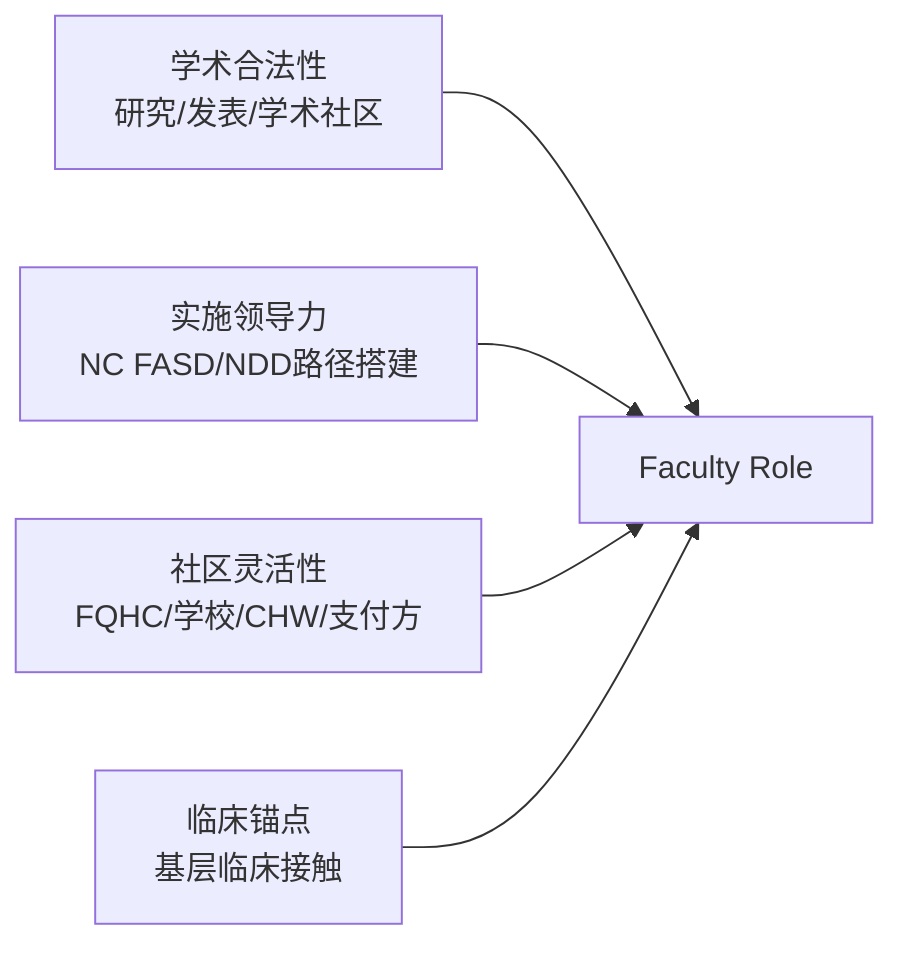

# Faculty Pathway — 1-Page Brief（Duke 方向）

**目标受众:** Vinod Srihari (Duke Psychiatry) / Truls Ostbye (Duke Community/Population Health)  
**目的:** 展示 Richard 的角色定位与 NeighborBridge 的实施科学主线  
**状态:** 📄 草稿完成 · 待审阅  
**文件路径:** `docs/faculty-pathway-brief-draft.md`  

---

## 主线陈述

Richard 的工作不是一组零散的项目——而是一条完整的系统路径：

> 为 FASD / NDD 的**早期识别**和**长期支持**搭建真实世界的持续路径，跨越初级保健、家庭、学校、社区/教会、CHW、支付方系统，以实施科学为方法论，以社区为实验室。

---

## 角色定位

Richard 最适合争取的角色是：

**Community-engaged, implementation-oriented, clinically anchored faculty role**

- **社区基础** — 在北卡真实社区中运行，而非纯学术环境
- **实施导向** — 搭建、测试、优化可在基层推广的筛选与干预路径
- **临床锚点** — 保持基层临床接触，使工作扎根于实际需求，而非纯理论

---

## 为什么是 Duke？/ 为什么是现在？

| 因素 | 说明 |
|---|---|
| **实施科学强项** | Duke Psychiatry 和 Community Health 方向均重视 implementation research，与 Richard 的路径搭建工作高度匹配 |
| **北卡基础** | FQHC 试点关系、学校系统合作、CHW 网络已在北卡建立 |
| **学术支持** | 耶鲁精神科教授已参与初步讨论（Vinod Srihari），提供学术校准 |
| **时机** | Q2 预算窗口期 + FASD/NDD 路径搭建已进入可展示阶段 |

---

## 当前工作基础

### 已搭建

- **FASD 早期识别与支持路径** — 在 FQHC 环境中运行的完整临床工作流
- **FQHC 试点关系** — 已确定的基层合作点
- **Trillium 支付方接触** — 试点机会窗口（Q2）
- **耶鲁学术合作** — 实施科学视角的学术校准

### 进行中

- **1-page brief** ✅ 草稿完成
- **Short bio（学者版）** — 待准备
- **CV（学术版）** — 部分完成
- **Institutional fit note** — 待准备
- **Support/Funding model** — 待构建

---

## 理想角色要素

### 资金模型理想比例

| 来源 | 比例 | 说明 |
|---|---|---|
| 院校薪资/研究时间 | 50% | 既有学术保障 |
| 外部资助 | 30% | 资助项目支持 |
| 咨询/服务 | 20% | 灵活收入补充 |

---

## 两条 Duke 路径

| 路径 | 联系人 | 方向 | 当前状态 |
|---|---|---|---|
| Psychiatry 入口 | Vinod Srihari | 实施科学 + 精神科 | 已通话，需跟进 |
| Community/Population Health 入口 | Truls Ostbye | 社区/实施/人口健康 | 过往有 career conversation，需梳理跟进 |

> 两条路径并行，不冲突——提升 Duke 期间的可选性和灵活性。

---

## 下一步建议

1. **审阅本篇 1-page brief** — Richard 确认内容和语调
2. **补充具体数据和成果** — 试点规模 / 产出 / 影响数据
3. **转入 Google Docs** — 便于协作修改
4. **发送给 Vinod** — 作为跟进入口
5. **准备 Truls 语境版本** — 如果是 population health 方向，调整措辞侧重

---

*草稿生成: 2026-04-24 · 来源: Faculty Pathway 面板 v1 · 待审阅*
